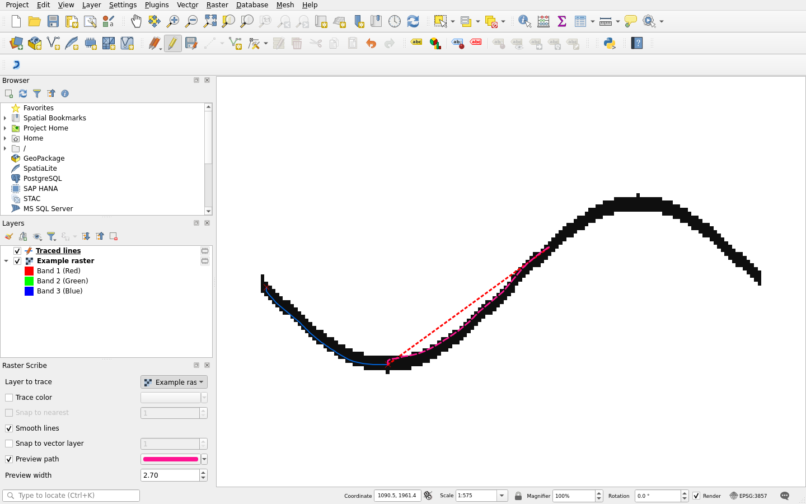

# Raster Scribe

Raster Scribe is a QGIS plugin for tracing lines in RGB raster maps. Click
along a contour, road, or other line, and the plugin follows pixels of a
similar color to draw vector geometry.

This is an independently maintained fork of
[Raster Tracer](https://github.com/mkondratyev85/raster_tracer), originally
developed by Mikhail Kondratyev. The fork is maintained by
[IongIer](https://github.com/IongIer).

## Differences from Raster Tracer

- Live path previews, with adjustable color and width.
- Windowed raster reads for working with large images.
- Saved color, snapping, smoothing, and preview preferences.
- Shortcuts for sampling a color and drawing a straight line with extra vertices.
- Cancel pending traces or undo the last segment while keeping earlier work.
- Support for QGIS 3.40+ and QGIS 4, using the same package.

See [the changelog](CHANGELOG.md) for details.



The blue line is drawn geometry; the pink line is the next segment's preview.

## Install

Build the plugin from the repository root with Python 3:

```sh
python3 scripts/package-plugin.py
```

In QGIS, open **Plugins → Manage and Install Plugins → Install from ZIP** and
select the ZIP created in `dist/`. Open Raster Scribe from the **Raster** menu
or its blue toolbar icon.

Raster Scribe can be installed alongside Raster Tracer. Each plugin keeps
its own preferences. Saved vector layers need no conversion.

## Use

Load an RGB raster and a MultiLineString or MultiCurve vector layer. Select
the vector layer in the Layers panel and click **Toggle Editing** (the pencil).
Activate Raster Scribe, then choose the raster under **Layer to trace**.
Click a starting point, move along the line to see the preview, and click to
add a segment. Right-click to finish, then click **Save Layer Edits** in QGIS.

[Trace your first line](documentation/usage.md#trace-your-first-line) using the
small example included in this repository. The guide also covers
[tasks](documentation/usage.md#common-tasks),
[controls](documentation/usage.md#controls-and-shortcuts), and
[troubleshooting](documentation/usage.md#troubleshooting).

Tested on Linux and Windows. macOS has not been tested.

## Development and support

- [Build and development](documentation/development.md)
- [Testing guide](test/README.md)
- [Report a problem](https://github.com/IongIer/raster_tracer/issues)

Maintenance follows the maintainer's own use of the plugin. Report bugs on
this fork's issue tracker, with the QGIS version and steps to reproduce them.

## License and credits

See [LICENSE](LICENSE) and the notices in the source files for licensing terms.

The blue icon is adapted from Raster Tracer's original icon.
