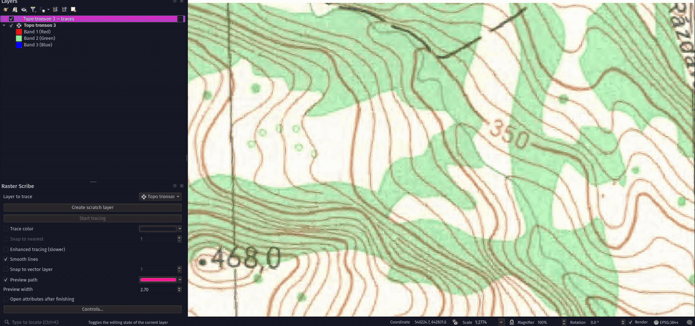

# Raster Scribe

Trace contours, roads and other lines from raster maps into QGIS vector layers.
Click along a line, check the live preview, and right-click to finish.

- Sample the line's color, snap to existing vertices, or draw across gaps.
- Toggle enhanced tracing for difficult text and line crossings.
- Create a scratch layer, enter attributes, and customize your shortcuts.
- Work on large rasters without loading the whole image into memory.

Requires **QGIS 3.40–4.x** and a **north-up RGB raster**. Indexed/palette and
single-band grayscale or black-and-white rasters need
[conversion to RGB](documentation/usage.md#convert-a-raster-to-rgb) first.
Uses libraries supplied with QGIS; no extra solver installation is needed.
Tested on Linux and Windows; macOS remains untested.

## Install

1. Download [raster_scribe-0.1.0.zip](https://github.com/IongIer/raster_scribe/releases/download/scribe-v0.1.0/raster_scribe-0.1.0.zip).
2. In QGIS, open **Plugins → Manage and Install Plugins → Install from ZIP**
   and select it. Use this plugin ZIP, not GitHub's **Source code** archive.

Scribe can be installed alongside Raster Tracer and keeps separate preferences.

## Quick start

1. Load your RGB raster. Open **Raster → Raster Scribe → Raster Scribe**, or
   click the blue toolbar icon.
2. Select the raster under **Layer to trace**, then click **Create scratch
   layer** and **Start tracing**.
3. Click a starting point, move along the line to check the preview, and click
   to accept segments. Right-click to finish.
4. Save the layer's edits. For a scratch layer, use **Make Permanent** from its
   layer menu to keep the data after closing QGIS.

The [usage guide](documentation/usage.md) covers controls and common problems.

## Development and support

See [development](documentation/development.md), [testing](test/README.md), and
[the changelog](CHANGELOG.md). [Report issues](https://github.com/IongIer/raster_scribe/issues)
with your QGIS version and steps to reproduce them.

## Credits and license

Maintained by [IongIer](https://github.com/IongIer), based on
[Raster Tracer](https://github.com/mkondratyev85/raster_tracer) by Mikhail
Kondratyev. The icon is adapted from the original; enhanced tracing adapts
Jean-Marie Mirebeau's HamiltonFastMarching solver.

Licensed as a combined plugin under **GPL-3.0-or-later**. See [LICENSE](LICENSE)
and [NOTICE.txt](NOTICE.txt) for the terms and original component notices.
