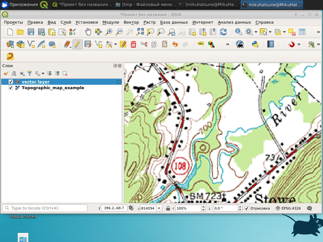

# RasterTracer

RasterTracer is a plugin for semi-automatic digitizing of an underlying raster
layer in QGis.  
It is useful, for example, when you need to digitize a scanned
topographic map, with curved black lines representing lines of equal heights of
the surface (contours). 
Instead of creating this curved vector line by manually clicking
at each segment of this curved line, with this plugin you
can click at the beginning of the curved line and at the end of the curved
line, and it will automatically trace over black pixels (or pixels that are
almost black) starting from the beginning to the end. 
By using this plugin you reduce
clicks while digitizing raster maps. 

The process is show here: 



## Compatibility and development

The same plugin package supports QGIS 3.40+ and QGIS 4 (Qt5 and Qt6).
Qt imports use `qgis.PyQt`, so QGIS selects its own Qt binding.

Run `make package` to build `dist/raster_tracer-0.3.4.zip` from the working
tree using ordinary Python, without QGIS or uv. It uses the checked-in
`resources.py`; after changing resources or icons, regenerate that file with
`make compile` (requires `pyrcc5`) before packaging. Install the ZIP through
QGIS's plugin manager.

The compatibility workflow checks lint and formatting in an independent job
and tests the packaged plugin in isolated QGIS 3.40, 3.44 and 4.0 containers.
No QGIS installation on the host is required.
See [test/README.md](test/README.md) for local commands and desktop validation.

Checks run after each push to `master`, or manually from the repository's
Actions tab. A newer run on the same branch cancels any older unfinished run.
PRs and releases are not required. Results appear in Actions and on the pushed
commit; a failed check does not undo the push. The workflow builds and tests
the ZIP but does not publish it. For a fork, enable workflows in the Actions
tab if GitHub has them disabled.

### Python development tools

Install [uv](https://docs.astral.sh/uv/getting-started/installation/) 0.8.4 or
newer and use Python 3.9+ for the separate development environment:

```sh
uv sync --locked
make lint
make format-check
make format
```

`make format` rewrites Python files; the other checks fail on violations.
To apply lint fixes, use `uv run --locked ruff check --fix .` and review the
diff. Ruff 0.16.8 is pinned in `pyproject.toml` and `uv.lock`; CI uses uv 0.8.4
and Python 3.13. Upgrade Ruff deliberately with
`uv add --dev 'ruff==<reviewed-version>'`, rerun validation, and commit the
manifest and lockfile together. Routine commands use `--locked` to reject
stale dependency metadata.

Ruff checks imports and core Python errors and formats handwritten Python at
88 columns, targeting Python 3.9 syntax. Generated `resources.py` and built
help are excluded, and Markdown is not formatted. Required resource imports
carry narrow unused-import exceptions. Ruff replaces the inherited Pylint
and pycodestyle commands; it does not reproduce Pylint's inference, docstring
or design checks.

uv manages only Ruff in `.venv`; it does not install the plugin. QGIS supplies
Qt, GDAL and NumPy, so do not add those packages to the tooling environment or
point `UV_PROJECT_ENVIRONMENT` at QGIS. Run the [container tests](test/README.md), or
`make test PYTHON=/path/to/qgis/python` with a configured PyQGIS interpreter.
Do not run `uv run make test`: its Python would be the tooling environment.
The ZIP builder continues to use the runtime allowlist in `pb_tool.cfg`;
the `pb_tool` application is not required.

## Profiling

Set `RASTER_TRACER_PROFILE=1` before starting QGIS to log raster sampling
timings and pathfinding profiles. On Linux, with QGIS installed:

```sh
RASTER_TRACER_PROFILE=1 qgis
```

Trace a representative RGB raster, then inspect the `RasterTracer` tab in
QGIS's Log Messages panel. Entries include sampler setup, raster window
read timings and memory use, and pathfinding duration, explored node count
and cProfile output. Profiling adds overhead; restart QGIS with the variable
unset or set to `0` for normal use.

## Usage

Tracing is enabled only if the selected vector layer is in the editing mode.

The geometry type of the vector layer has to be MultiLineString / MultiCurve.

You can choose the color that will be traced over in the raster image. 
To do this, check the box `trace color` and select the desired color in
the dialog window.

If `trace color` is not checked, the plugin will try to trace the color that is 
similar to the color of the pixel on the map at the place where you clicked the
last time.
This means that each time you click on the map, it will trace a slightly
different color.
This slows down tracing a bit, but may be useful if the color of the line you are
tracing varies over the map.

## What image can it trace?

Right now the plugin can trace images that have a standard RGB color space. 
It has no support for any black and white, grey, or indexed images. 
This means that if your image has an unsupported colorspace, 
you have to convert the colorspace of your image to RGB first. This can be done in QGis with:

`Processing >> Toolbox >> GDAL >> Raster conversion >> PCT to RGB` 

or directly in the CLI with:

`pct2rgb.py <infile> <outfile> -of GTiff -b 1`

Raster, canvas and vector layer CRSs may differ. Endpoints and snap tolerances
use the canvas destination CRS; geometry is transformed to the bound vector
layer before editing. Failed transformations leave earlier segments intact.
Rotated/skewed raster mappings are rejected. Nodata and nonfinite RGB pixels
are impassable, including when sampling the trace color.

## Tracing behavior and limits

Preview and committed segments use the same resolved endpoints and smoothing.
Color snapping uses an inclusive radius of up to 99 raster pixels. Vector
snapping then takes precedence and selects the nearest vertex across candidate
features. Its tolerance is a linear distance in **canvas CRS map units**;
saved tolerances are not screen pixels or automatically converted to meters.

Escape cancels the pending segment and retains earlier geometry. B cancels a
pending segment, otherwise undoes the last tracer command only while it is
still the bound layer's top undo command. B can also remove the initial anchor
on an empty layer. Right-click finishes the line. Changing raster/target layer,
CRS or transform context, stopping editing, external geometry edits, or
switching tools finishes the session while retaining written geometry.

Changing color, mode, smoothing or snapping cancels pending work and retains
previous segments. Disabling preview cancels a segment adopted from preview;
an independent committed trace can finish. Closing/reopening the dock shares
one scheduler: cancelled workers drain before replacement work starts.

Search uses four-neighbor movement and minimizes the sum of entered-pixel
squared RGB distances, quantized to integers, within a deterministic padded
window. Zero-cost pixels remain zero cost. Padding stays at 1024 pixels with a
minimum window dimension of 512 (clipped to raster size). Cache history does
not enlarge or shrink the searched graph.

Internal caps are 8,388,608 search pixels, 256 MiB of accounted array/scratch
allocations, 1,000,000 discovered nodes and 1,000,000 frontier entries. The
array cap includes a reserve for cursor sampling, and may be reached before
the pixel cap. A limit failure asks for a shorter segment and does not commit
partial geometry. These are allocation/count limits, not a bound on total
QGIS/GDAL/Python process memory. Large reads, cost preparation, search and
smoothing run in one background task; Python search can still contend for the
GIL.

## Useful keys


`b` - cancel the pending segment, or undo the last owned tracer segment

`a` - switch between "trace" mode and "straight-line" mode.

`Esc` - cancel tracing segment. Useful when raster_tracer struggles to find 
a good path between clicked points (Usually when points are far from each other).

## Vibed Changes

- Reworked raster handling for large imagery: lazy windowed sampling, padded tile loads, and profiling hooks (`RASTER_TRACER_PROFILE`) keep huge rasters responsive and measurable.
- Added asynchronous hover previews with configurable colour/width, smoothing that mirrors the final geometry, and robust cancellation/queuing so the map feedback feels instant.
- Improved tracing ergonomics: the `T` shortcut resamples the trace colour beneath the cursor, shortcut filtering keeps layer-tree focus from eating tracing keys, and snap logic stays aligned with the active raster window.
- Persisted dock preferences across sessions—trace colour state and value, both snap toggles with their tolerances, smoothing, and preview controls—using `QSettings`.
